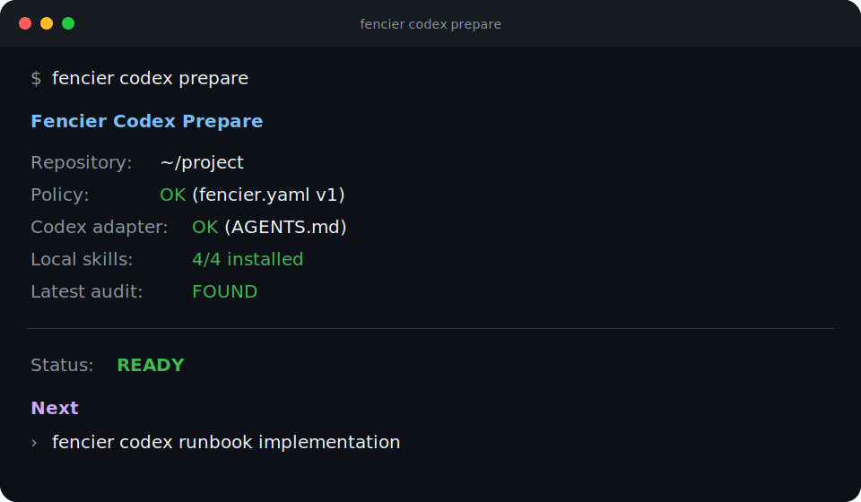
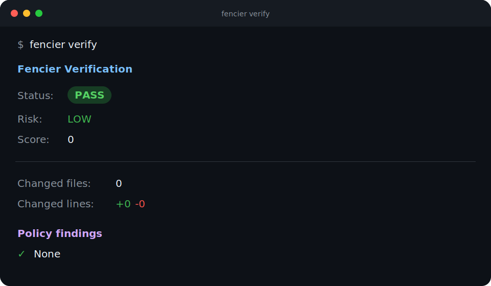
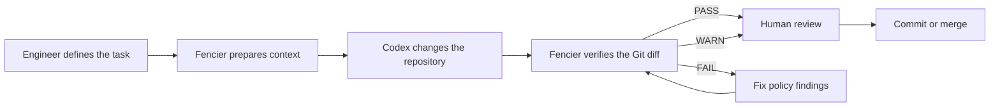
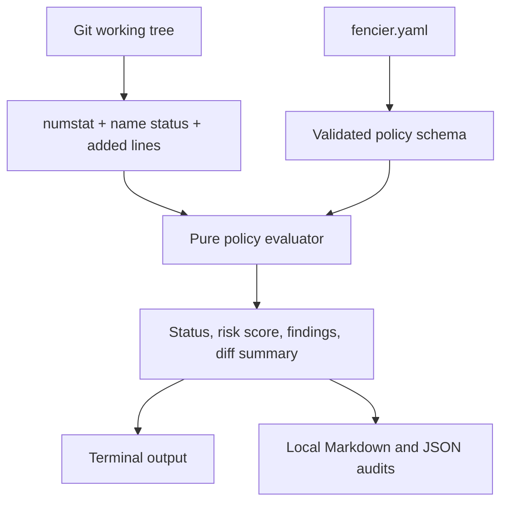
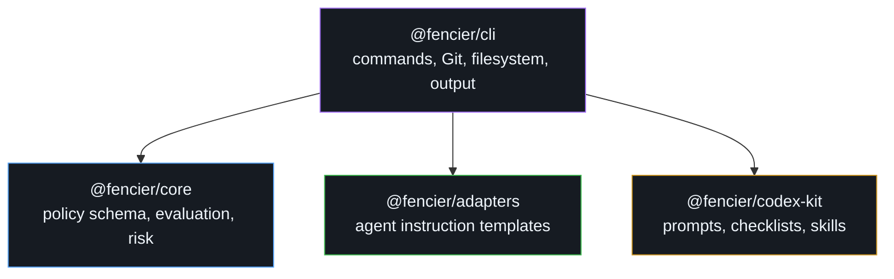

# Fencier

<div align="center">

**Keep Codex inside the task.**

A local-first boundary layer that prepares governed Codex sessions and verifies the resulting Git diff against explicit repository policy.

[](https://github.com/DerMayer1/Fencier/actions/workflows/ci.yml)
[](LICENSE)
[](package.json)
[](package.json)
[](docs/security.md)

</div>

---

Fencier gives AI-assisted development a deterministic operating boundary. Before a Codex session, it installs repository instructions, local skills, prompts, checklists, and runbooks. After the session, it evaluates the local Git diff for scope drift, sensitive changes, possible secrets, missing tests, and oversized patches.

Fencier does not replace Codex, code review, or security tooling. It makes the contract around an agent's work explicit, inspectable, and difficult to ignore.

> [!IMPORTANT]
> Fencier is currently a development preview and is not published to npm. Use the local development workflow below.

## See it in action

<table>
  <tr>
    <td width="50%"><strong>Prepare a governed session</strong></td>
    <td width="50%"><strong>Verify the resulting diff</strong></td>
  </tr>
  <tr>
    <td></td>
    <td></td>
  </tr>
</table>

## Why Fencier

Coding agents are effective at implementation, but the surrounding contract often exists only in a prompt. That contract can be forgotten as context grows or the task expands.

Fencier moves the contract into the repository:

| Concern | Repository control | Fencier behavior |
|---|---|---|
| Scope drift | `allowed_paths`, change limits | Warns when the diff leaves the intended boundary |
| Dangerous files | `blocked_paths` | Fails verification when a blocked path changes |
| High-review areas | `sensitive_paths` | Makes security, billing, CI, and infrastructure changes explicit |
| Secret exposure | `block_secret_patterns` | Scans added lines and reports masked previews only |
| Critical changes without tests | `require_tests_for` | Warns when protected paths change without a test file in the diff |
| Agent instructions | `AGENTS.md` | Installs a repository-level operating contract for Codex |
| Review evidence | `.fencier/audits/` | Writes local Markdown and JSON reports without storing full patches by default |

The result is a small control loop around the agent, not another agent:



## Quick start

### 1. Build and link the development CLI

Requirements: Node.js 22 or newer, pnpm 11.7.0, and Git.

```bash
git clone https://github.com/DerMayer1/Fencier.git
cd Fencier
pnpm install
pnpm run ci

cd packages/cli
npm link
```

Confirm that the command is available:

```bash
fencier doctor
```

### 2. Initialize a target repository

Run these commands from the root of the Git repository you want Fencier to govern:

```bash
fencier init --codex
fencier codex skill install all
fencier codex prepare
```

Initialization creates or installs:

```text
your-repository/
├── AGENTS.md                  # Codex operating contract
├── fencier.yaml              # deterministic policy
└── .fencier/
    ├── audits/               # local verification reports
    └── skills/               # repository-local Codex skill material
```

Initialization is idempotent. Existing `fencier.yaml` and `AGENTS.md` files are preserved unless `--force` is explicitly supplied.

### 3. Start a Codex task with a runbook

```bash
fencier codex runbook implementation
```

Available runbooks cover `implementation`, `bugfix`, `review`, `refactor`, `security`, and `fix-audit`. A runbook composes the repository brief, task prompt, checklist, latest audit context, and completion commands into one deterministic session package.

### 4. Verify before committing

```bash
fencier verify
fencier audit show latest
```

Use `--staged` to inspect only staged changes or `--base <ref>` to compare against a specific Git reference:

```bash
fencier verify --staged
fencier verify --base origin/main
```

## Policy as code

Every governed repository owns its boundary in `fencier.yaml`:

```yaml
version: 1

scope:
  allowed_paths:
    - src/**
    - tests/**
    - package.json
  blocked_paths:
    - .env
    - .env.*
    - secrets/**
  sensitive_paths:
    - src/auth/**
    - src/payments/**
    - .github/workflows/**
  ignored_paths:
    - dist/**
    - coverage/**

rules:
  max_files_changed: 8
  max_lines_changed: 500
  block_secret_patterns: true
  require_tests_for:
    - src/auth/**
    - src/payments/**

audit:
  write_markdown: true
  write_json: true
  include_patch: false

adapters:
  codex: true
  claude: false
  cursor: false
  copilot: false
```

Path patterns use glob syntax. Ignored paths are removed before the diff summary and policy rules are evaluated.

## Deterministic verification

`fencier verify` collects the working tree through Git, converts it into typed diff data, and passes that data to the pure policy engine. The evaluator applies rules in a stable order and returns structured findings.



### Findings and risk weights

| Signal | Severity | Score |
|---|---:|---:|
| Blocked path changed | Critical | 50 |
| Possible secret detected | Critical | 50 |
| Sensitive path changed | High | 25 |
| Protected path changed without tests | High | 25 |
| File-count limit exceeded | Medium | 15 |
| Line-count limit exceeded | Medium | 15 |
| File outside allowed paths | Medium | 15 |

Scores are additive and capped at 100:

| Score | Risk |
|---:|---|
| `0–19` | Low |
| `20–49` | Medium |
| `50–89` | High |
| `90–100` | Critical |

Verification status and risk are related but distinct:

- `PASS`: no policy findings.
- `WARN`: one or more non-critical findings require review.
- `FAIL`: at least one critical finding blocks the workflow.

Stable process exit codes make the verifier suitable for scripts and CI:

| Exit code | Meaning |
|---:|---|
| `0` | Verification passed or produced warnings |
| `1` | Verification failed |
| `3` | Configuration, environment, or command usage error |

## Architecture

Fencier is a TypeScript monorepo with strict package boundaries:



| Package | Owns | Must not own |
|---|---|---|
| `@fencier/core` | Policy schema, diff types, secret heuristics, findings, risk scoring | Filesystem, Git, terminal output, process state |
| `@fencier/cli` | Commands, Git collection, local files, audits, orchestration | Duplicated policy semantics |
| `@fencier/adapters` | Codex-first and compatibility instruction templates | File writes, policy evaluation |
| `@fencier/codex-kit` | Versioned prompts, checklists, and skill content | Repository inspection, model calls, file writes |

This split keeps policy decisions unit-testable and makes every report traceable back to structured inputs.

## Command reference

| Command | Purpose |
|---|---|
| `fencier init --codex` | Initialize policy, audit workspace, and the Codex adapter |
| `fencier doctor` | Check that the CLI is wired correctly |
| `fencier codex prepare` | Check policy, adapter, local skills, and latest audit readiness |
| `fencier codex brief` | Print deterministic repository context for Codex |
| `fencier codex runbook <id>` | Compose a complete task runbook |
| `fencier codex prompt list\|show` | Inspect versioned prompt templates |
| `fencier codex checklist list\|show` | Inspect task checklists |
| `fencier codex skill list\|show\|install` | Inspect and install repository-local skills |
| `fencier verify` | Evaluate the current diff and write configured audits |
| `fencier check` | Compatibility alias for `verify` |
| `fencier audit list` | List local audit reports |
| `fencier audit show latest` | Print the latest Markdown audit |
| `fencier adapters list\|install` | Inspect or install agent instruction adapters |

Run `fencier <command> --help` for command-specific options.

## Security and privacy

Fencier is local-first by design:

- no account or hosted backend;
- no telemetry by default;
- no source code, diff, policy, or audit upload;
- possible secrets are shown as masked previews;
- full patches are excluded from audits by default;
- all decisions are derived from local policy and local Git state.

Fencier is a boundary verifier, not a complete secret scanner or security analyzer. Human review remains required, especially for authentication, payments, CI/CD, migrations, and infrastructure changes. See the [security model](docs/security.md) for the complete contract.

## What Fencier is not

- An AI coding agent or model wrapper
- A proof that code is correct or secure
- A replacement for tests or human review
- A full SAST or secret-scanning suite
- A SaaS dashboard, CI platform, or telemetry service

These boundaries are deliberate. Fencier stays useful by remaining small, deterministic, and explainable.

## Development

```bash
pnpm install
pnpm run ci
pnpm run pack:cli
```

Run the built CLI without linking it globally:

```bash
node packages/cli/dist/index.js doctor
node packages/cli/dist/index.js codex prepare
node packages/cli/dist/index.js verify --no-audit
```

The repository currently contains 45 tests across the policy engine, Git collection, initialization, audits, adapters, skills, runbooks, and CLI behavior.

## Project status

Implemented today:

- deterministic local diff verification;
- Markdown and JSON audit reports;
- Codex `AGENTS.md` integration;
- versioned prompts, checklists, and local skill material;
- implementation, bugfix, review, refactor, security, and audit-fix runbooks;
- compatibility adapters for Claude Code, Cursor, and GitHub Copilot;
- idempotent repository initialization;
- local CLI packaging validation and GitHub Actions CI.

Not implemented yet:

- npm publication;
- global Codex skill installation;
- policy rule plugins;
- a richer fixture-based benchmark suite.

## Documentation

- [Architecture](docs/architecture.md)
- [Codex Kit](docs/codex-kit.md)
- [Deterministic verifier](docs/deterministic-verifier.md)
- [Policy model](docs/policy-model.md)
- [Security](docs/security.md)
- [Quality bar](docs/quality-bar.md)
- [Release process](docs/release.md)

## License

Fencier is available under the [MIT License](LICENSE).
